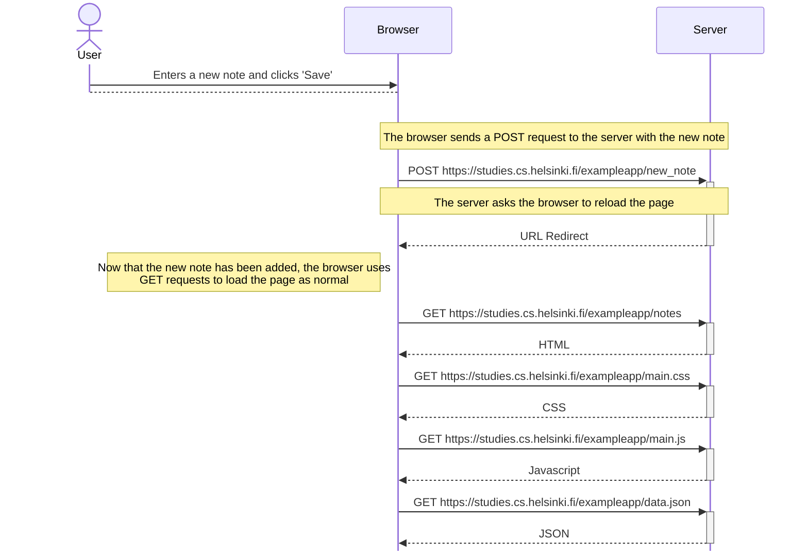

```mermaid
---
config:
  mirrorActors: false
---
sequenceDiagram

  actor User
  participant Browser
  participant Server

  % The user types in a note and clicks save, which causes the browser to send it to the server.
  User->>Browser: Enters a new note and clicks 'Save'
  destroy User
  Browser-->User:

  % The browser sends the new note to the server.
  Note over Browser,Server: The browser sends a POST request to the server with the new note
  Browser->>+Server: POST https://studies.cs.helsinki.fi/exampleapp/new_note

  % The server creates a new note object using the users input and the current date, and adds it to the array containing the list of notes. The server also tells the browser to perfrom a redirect to '/exampleapp/notes'. Since that is the current page, it reloads.
  Note over Browser,Server: The server asks the browser to reload the page
  Server-->>-Browser: URL Redirect
 
  Note left of Browser: Now that the new note has been added, the browser uses<br/> GET requests to load the page as normal
  Browser->>+Server:GET https://studies.cs.helsinki.fi/exampleapp/notes
  Server-->>-Browser: HTML

  Browser->>+Server: GET https://studies.cs.helsinki.fi/exampleapp/main.css
  Server-->>-Browser: CSS

  Browser->>+Server: GET https://studies.cs.helsinki.fi/exampleapp/main.js
  Server-->>-Browser: Javascript

  % The JSON data returned now includes the new note added onto the end.
  Browser->>+Server: GET https://studies.cs.helsinki.fi/exampleapp/data.json
  Server-->>-Browser: JSON
```
