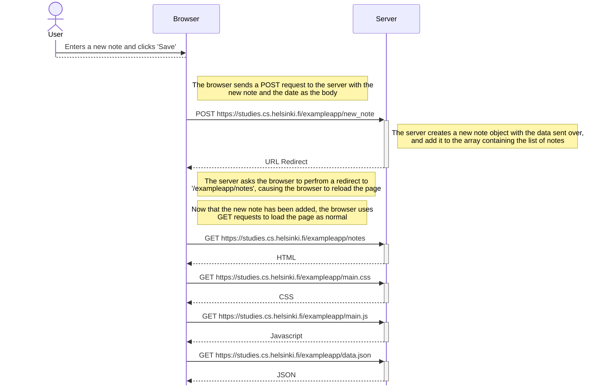

```mermaid
---
config:
  mirrorActors: false
---
sequenceDiagram

  actor User
  participant Browser
  participant Server

  % The user types in a note and clicks save, which causes the browser to send it to the server
  User->>Browser: Enters a new note and clicks 'Save'
  destroy User
  Browser-->User:

  Note right of Browser: The browser sends a POST request to the server with the<br/> new note and the date as the body

  Browser->>+Server: POST https://studies.cs.helsinki.fi/exampleapp/new_note

  Note right of Server: The server creates a new note object with the data sent over,<br/> and add it to the array containing the list of notes

  Server-->>-Browser: URL Redirect

  Note right of Browser: The server asks the browser to perfrom a redirect to<br/> '/exampleapp/notes', causing the browser to reload the page

  Note right of Browser: Now that the new note has been added, the browser uses<br/> GET requests to load the page as normal

  Browser->>+Server: GET https://studies.cs.helsinki.fi/exampleapp/notes
  Server-->>-Browser: HTML

  Browser->>+Server: GET https://studies.cs.helsinki.fi/exampleapp/main.css
  Server-->>-Browser: CSS

  Browser->>+Server: GET https://studies.cs.helsinki.fi/exampleapp/main.js
  Server-->>-Browser: Javascript

  Browser->>+Server: GET https://studies.cs.helsinki.fi/exampleapp/data.json
  Server-->>-Browser: JSON
```
