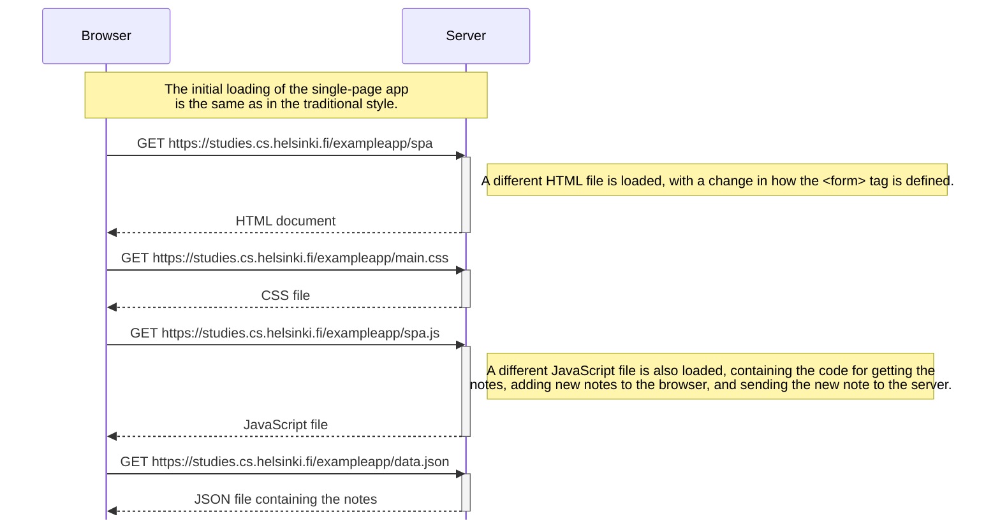

```mermaid
---
config:
  mirrorActors: false
---
sequenceDiagram

  participant Browser
  participant Server

  Note over Browser,Server: The initial loading of the single-page app<br> is the same as in the traditional style.

  Browser->>Server: GET https://studies.cs.helsinki.fi/exampleapp/spa
  activate Server
  Note right of Server: A different HTML file is loaded, with a change in how the <form> tag is defined.
  Server-->>Browser: HTML document
  deactivate Server

  Browser->>Server: GET https://studies.cs.helsinki.fi/exampleapp/main.css
  activate Server
  Server-->>Browser: CSS file
  deactivate Server

  Browser->>Server: GET https://studies.cs.helsinki.fi/exampleapp/spa.js
  activate Server
  Note right of Server: A different JavaScript file is also loaded, containing the code for getting the<br>notes, adding new notes to the browser, and sending the new note to the server.
  Server-->>Browser: JavaScript file
  deactivate Server

  Browser->>Server: GET https://studies.cs.helsinki.fi/exampleapp/data.json
  activate Server
  Server-->>Browser: JSON file containing the notes
  deactivate Server

```
