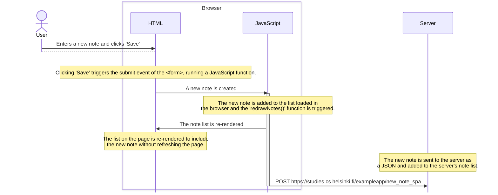

```mermaid
---
config:
  mirrorActors: false
---
sequenceDiagram

  actor User
  box Browser
  participant HTML
  participant JavaScript
  end
  participant Server

  User->>HTML: Enters a new note and clicks 'Save'
  destroy User
  HTML-->User:
  Note over HTML: Clicking 'Save' triggers the submit event of the <form>, running a JavaScript function.

  HTML->>JavaScript: A new note is created
  activate JavaScript

  Note over JavaScript: The new note is added to the list loaded in<br>the browser and the 'redrawNotes()' function is triggered.
  JavaScript->>HTML: The note list is re-rendered
  Note over HTML: The list on the page is re-rendered to include<br>the new note without refreshing the page.

  Note over Server: The new note is sent to the server as<br>a JSON and added to the server's note list.
  JavaScript->>Server: POST https://studies.cs.helsinki.fi/exampleapp/new_note_spa
  deactivate JavaScript

```
